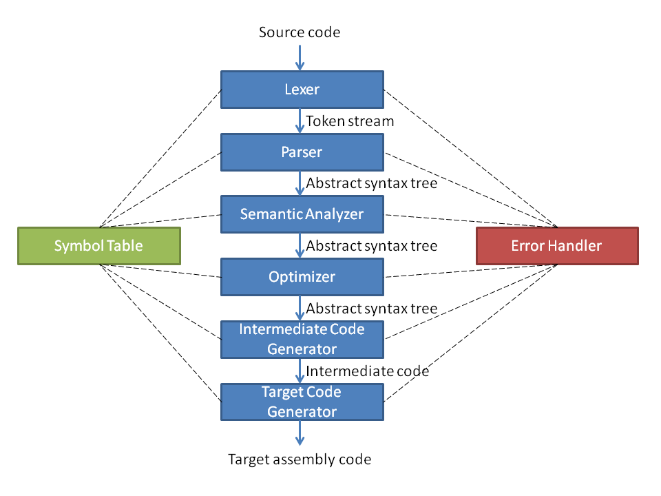
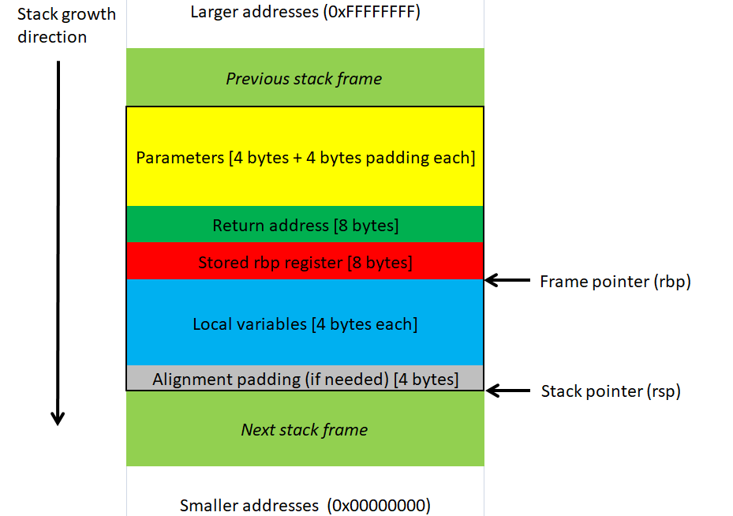
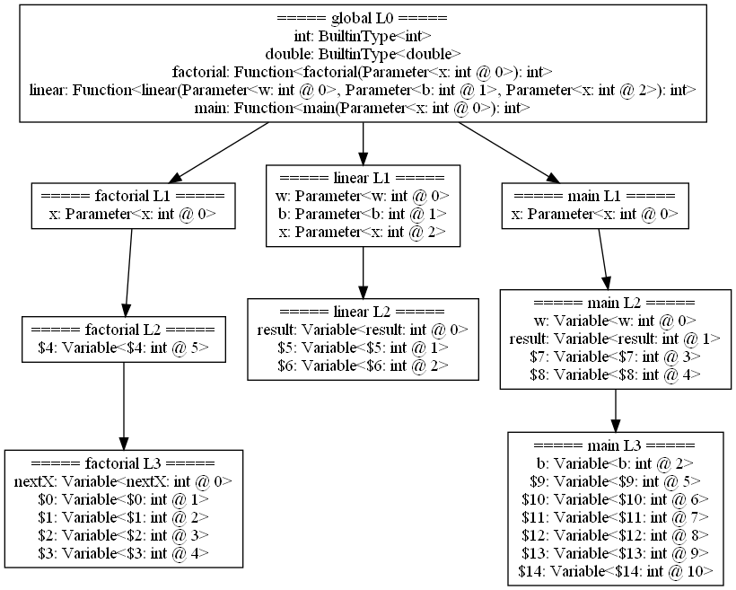

# Sea Sub Compiler


A compiler for a small subset (sub) of the C (sea) programming language.

## Usage

Stand in the root if the SeaSubCompiler directory and run:
```
python main.py -o 1 --ast ast.dot --symbol-table symbol-table.dot --intermediate-code intermediate-code.ic demo.c
```

This will compile *demo.c* into an assembly file named *demo.s*.

### Executable

To create an executable from the assembly file one can for example use gcc as follows.


Compile the assembly file into an object file:
```
gcc -c demo.s
```

Link the object file into an executable:
```
gcc demo.o
```

Run the executable:
```
./a.out
```

Print the output (prints the output from the previous command):
```
echo $?
```
Note that the returned value is interpreted as an 8 bit unsigned int.

Use gcc to generate an assembly file that can be compared with the output from the Sea sub compiler:
```
gcc -S -O0 -fno-asynchronous-unwind-tables demo.c
```

### Visualization

The Sea sub compiler can generate .dot graph files containing the abstract syntax tree and the symbol table. These can
be visualized by using e.g. Graphvis:
```
dot -Tpng -o ast.png ast.dot
dot -Tpng -o symbol-table.png symbol-table.dot
```

## Architecture

This section describes the architecture of the sea sub compiler.



### Lexer

The lexical analyzer (also known as scanner or tokenizer). This is the first step of the compiler that takes the raw
sea sub source code as input and outputs tokens (e.g. numbers, brackets, operators, etc.). It performs the first part
of the syntax check as it only accepts tokens that are part of the sea sub language.

### Parser

The second step of the compiler takes tokens from the lexer as input and outputs an abstract syntax tree. It performs
the second part of the syntax check by verifying that the stream of tokens fulfills the grammar of the sea sub
language. It is this part of the compiler that implements the grammar as a recursive descent parser.

#### Abstract Syntax Tree

A core part of the compiler is the node visitor. It provides functionality to traverse an abstract syntax tree by
implementing the *visitor* design pattern. The sub classes of the node visitor provides a visitor function for
each relevant node in the abstract syntax tree. The default visitor will be used for nodes that do not have a visitor.
The Sea sub compiler uses the node visitor heavily, for example:

* Semantic analysis
* Symbol table creation
* Visualization


#### Grammar

This section defines the grammar of the sea sub language.

```
translation_unit ->
    function_definition_list EOF

function_definition_list ->
    function_definition |
    function_definition function_definition_list

function_definition ->
    type_specifier identifier '(' parameter_list ')' compound_statement

parameter_list ->
    parameter_declaration |
    parameter_declaration ',' parameter_list

parameter_declaration ->
    type_specifier identifier

compound_statement ->
    '{' '}' |
    '{' statement_list '}' |
    '{' declaration_list statement_list '}'

declaration_list ->
    declaration |
    declaration declaration_list

declaration ->
    type_specifier identifier ';'

statement_list ->
    statement |
    statement statement_list

statement ->
    compound_statement |
    expression_statement |
    selection_statement |
    jump_statement

selection_statement ->
    'if' '(' expression ')' statement 'else' statement

jump_statement ->
    'return' expression ';'

expression_statement ->
    ';' |
    identifier '=' expression ';'

expression ->
    additive_expression

additive_expression ->
    multiplicative_expression |
    additive_expression '+' multiplicative_expression |
    additive_expression '-' multiplicative_expression
=> / remove left recursion / =>
additive_expression ->
    multiplicative_expression ('+'|'-' multiplicative_expression)*

multiplicative_expression ->
    unary_expression |
    multiplicative_expression '*' unary_expression |
    multiplicative_expression '/' unary_expression
=> / remove left recursion / =>
multiplicative_expression ->
    unary_expression ('*'|'/' unary_expression)*

unary_expression ->
    primary_expression |
    '+' unary_expression |
    '-' unary_expression

primary_expression ->
    constant |
    identifier |
    '(' expression ')' |
    identifier '(' argument_expression_list ')'

argument_expression_list ->
    additive_expression |
    additive_expression ',' argument_expression_list

type_specifier ->
    'int' |
    'double'

identifier ->
    IDENTIFIER

constant ->
    INTEGER_CONSTANT |
    DOUBLE_CONSTANT
```

An example of a complete C grammar can be found here: https://www.lysator.liu.se/c/ANSI-C-grammar-y.html

### Semantic Analyzer

The third step of the compiler verifies the semantic correctness of the program. The abstract syntax tree created by
the parser is the input and the output is a verified abstract syntax tree. The semantic verification includes type
correctness and declaration of variables before use.

A prerequisite for this stage is that a symbol table has been attached to the abstract syntax tree.

### Optimizer

The fourth step of the compiler performs optimizations on the abstract syntax tree. The output is a modified abstract
syntax tree. Currently only constant folding is implemented. Optimization is probably the most important part of a
compiler and it can be performed in several of the compilation stages.

### Intermediate Code Generator

The fifth step of the compiler generates intermediate code from the abstract syntax tree. Intermediate code is a
platform independent assembler like representation of the program. The symbol table is extended with temporary
variables (named e.g. *$1*, *$2*, etc.) as needed.

The Sea sub compiler uses the quadruple format for the intermediate code:
```
operator    operand_1    operand_2    result
```

The *operator* performs an operation on the *operands* and stores the result in *result*. Typically the operands and
result are variable identifiers, the following is the complete list of valid types (depending on the operator):

* *const*: an integer constant
* *sym_id*: an identifier (i.e. name) of a variable in the symbol table
* *label*: a label marking a possible jump location

#### Instructions

The following table defines the valid quadruple instructions.

| Operator   | Operand 1 | Operand 2 | Result | Description                      |
| ---------- | --------- | --------- | ------ | -------------------------------- |
| q_load     | const     | -         | sym_id | Loads a constant value           |
| q_uplus    | sym_id    | -         | sym_id | Unary positive                   |
| q_uminus   | sym_id    | -         | sym_id | Unary negation                   |
| q_plus     | sym_id    | sym_id    | sym_id | Binary addition                  |
| q_minus    | sym_id    | sym_id    | sym_id | Binary subtraction               |
| q_mult     | sym_id    | sym_id    | sym_id | Binary multiplication            |
| q_div      | sym_id    | sym_id    | sym_id | Binary division                  |
| q_assign   | sym_id    | -         | sym_id | Assignment                       |
| q_jmp      | label     | -         | -      | Unconditional jump               |
| q_jmpifnot | label     | sym_id    | -      | Jump if false/zero               |
| q_param    | sym_id    | -         | -      | Function parameter               |
| q_call     | sym_id    | const     | sym_id | Call a function                  |
| q_label    | label     | -         | -      | Specify a possible jump location |
| q_return   | label     | sym_id    | -      | Return from a function           |

#### Function Calls

A function call is performed by adding a *q_param* instruction for each argument followed by a *q_call* instruction.
The *q_param* instructions must be in reverted parameter order (i.e. right to left) and located just before the
*q_call* instruction with no other instructions in between. The reason for the inverted order is to make life easier
for the target code generator (due to the stack data structure). The first operator of the *q_call* instruction is the
id of the function (i.e. its name), the second is the number of parameters. Each function must have a *q_label*
instruction at the very end of the function. The *q_return* instruction is used to return from a function. The first
parameter is the label at the end of the corresponding function and the second parameter is the return value.

### Target Code Generator

The sixth and last step of the compiler generates target code from the intermediate code. This part of the compiler
targets a specific architecture (e.g. x86, aarch64, etc.). The current implementation generates code for the x86-64
architecture. It is quite simple to add support other architectures to the compiler, the only thing needed is to add
another target code generator. All other parts of the compiler remains the same.

It is very difficult to generate good target code (i.e. assembly). One important part of a target code generator is
register allocation. Reading and writing to/from main memory is really slow compared to operating on register,
therefore it is important to keep as much as possible in registers as long as possible. One approach is to mode the
problem as a graph, the nodes represent live ranges of symbols and the edges shows which symbols are live
simultaneously. The register allocation can then be solved as a graph-coloring problem using the Chaitin's algorithm.

The current implementation do however not make any effort in producing good code, it is a quite stupid translator of
the intermediate code.

An interesting implementation detail is how the module performs dispatching to the correct functions. To call a
module local function using a string the following can be used:

```
globals()[function_string](arg1, arg2)
```

To dispatch a call to a function depending on the type of the first parameter the functools' singledispatch can be
used as follows:

```
@functools.singledispatch
def _my_func(arg):
    raise NotImplementedError()


@_my_func.register(int)
def _(arg):
    print("arg is an int")


@_my_func.register(list)
def _(arg):
    print("arg is a list")
```

#### Calling Convention

Although the target architecture is x86-64 the target code generator does not follow a common calling convention
(e.g. Microsoft x64 or System V AMD64 ABI). Instead it implements its own as follows.

* The stack pointer must always be aligned to 8 bytes (and grows towards lower addresses).
* Only the *int* data type is supported and the size is 32 bits (i.e. 4 bytes).
* The rax, rcx, rdx registers (and their 32 bits counterpart eax, ecx, and edx) are volatile registers, meaning that
they must be saved by the caller.
* The rbx, rsp, and rbp registers are non-volatile, meaning that they must be restored by the callee.

Caller:

1. Push the parameters on the stack in revert order (e.g. right to left), so that the first parameter is on top
of the stack, making sure the stack pointer is always aligned to 8 bytes.
2. The return address is pushed to the stack (implicitly done by the *call* instruction).
3. Jump to the called function (done by the *call* instruction).
4. When control is returned the parameters are removed from the stack.
5. The return value can be found in the return register (*eax*).

Callee:

1. Push the stack frame pointer register (*rbp*) to the stack
2. Set up a new stack frame pointer by moving the stack pointer register (*rsp*) to the stack frame pointer register
(*rbp*).
3. Allocate memory for the local parameters on the stack.
4. Execute the body of the function.
5. Move the return value to the return register (*eax*).
6. Remove the local variables from the stack.
7. Restore the stack frame pointer register (*rbp*) by popping it from the stack.
8. Jump back to the caller (done by the *ret* instruction).
9. Remove the return address from the stack (implicitly done by the *ret* instruction).



### Symbol Table

This component is responsible to manage all kinds of symbols in the language, for built-in types, variables and
functions. To support lexical scopes it is implemented as a tree data structure, were each node corresponds to a scope
level.

The symbol table is attached to the abstract syntax tree by adding a *symbol table* member to each of the node in the
abstract syntax tree, referring to the corresponding lexical scope in the symbol table, using the visitor design
pattern.

#### Data Structure

To support lexical scoping the symbol table is implemented as tree, where each node represents a lexical scope.
The nodes are implemented as a hash map (i.e. dictionary) where the key is the id (name) of the symbol. The [] operator
is overloaded to first look for a symbol in the current scope and if can't be found the tree is traverse towards the
root until the symbol is found. Each type of symbol is implemented as a separate class.



### Error Handler

This component is responsible for the error handling and is used by all parts of the compiler.
